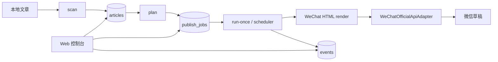

# 架构设计

Status: Current P0 architecture

## 总体定位

当前架构收敛为：**微信公众号优先架构**。

现有运行主线保持不变：

阶段一不把当前代码迁移到完整多平台架构。未来 adapter、manifest、content_package 只作为 backlog 说明。

## 1. Content Layer

负责读取和保存本地内容。

- 本地 Markdown / TXT / HTML
- 小说章节
- 长文文章
- 封面图片
- `articles/inbox/`
- `articles/imported/`
- `articles/published/`
- `articles/covers/`

当前数据主表仍是 `articles`。不得为了未来平台提前重做当前数据库。

## 2. Collection Layer

负责把文章组织成合集或专栏。

- `collection.yaml`
- 多合集
- 标题模板
- 默认封面
- 默认发布时间
- 章节排序
- 合集排期规则

当前已有 `collections`、`tags`、`article_tags` 基础表。后续扩展应先服务微信公众号文章管理。

## 3. Render Layer

负责把本地文章转换为微信公众号可用内容。

- Markdown -> WeChat HTML
- 段落样式
- 图片处理
- 摘要截断
- 预览快照
- 发布正文标题去重
- HTML 转义和实体归一化

渲染输出必须同时服务 Web 预览和真实 `draft/add`，避免“预览看起来对，草稿实际错”的分叉。

## 4. WeChat Publish Layer

负责微信公众号官方 API 路线。

- `WeChatOfficialApiAdapter`
- `WeChatDraftService`
- `WeChatMaterialService`
- `WeChatPublishService`
- `WeChatErrorMapper`

当前代码对应：

- `src/wechat_article_scheduler/adapters/real.py`
- `src/wechat_article_scheduler/adapters/wechat_http.py`
- `src/wechat_article_scheduler/adapters/mock.py`
- `src/wechat_article_scheduler/adapters/base.py`

阶段一可以逐步提炼 service，但不能重写掉已跑通的微信草稿创建链路。

## 5. WeChat Browser Assist Layer

只作为 API 无法覆盖字段时的后备方案。

允许能力：

- Playwright / MCP / DOM 操作
- 打开公众号后台
- 打开草稿箱
- 辅助定位草稿
- 辅助填写 API 不支持字段
- 辅助上传或确认封面
- 辅助截图
- 停在人机确认

禁止能力：

- 不绕过登录
- 不绕过验证码
- 不保存平台密码
- 不保存后台 cookie
- 不规避平台风控
- 不默认点击最终发布

browser_assist 是个人本地自用后备方案，不是商业 SaaS 自动发布能力。

## 6. Scheduler Layer

负责本地任务队列和状态流转。

核心状态：

- `scheduled_at`
- `pending`
- `running`
- `retry_waiting`
- `next_retry_at`
- `failed`
- `draft_created`
- `published`

当前对应：

- `publish_jobs`
- `src/wechat_article_scheduler/plan.py`
- `src/wechat_article_scheduler/scheduler/runtime.py`
- `src/wechat_article_scheduler/scheduler/domain.py`
- `src/wechat_article_scheduler/scheduler/policies.py`

阶段一目标是本地稳定运行，而不是引入大型队列系统。

## 7. Web Console Layer

Web 控制台是 desktop-first local workbench。

页面目标：

- Dashboard
- 文章列表
- 文章详情
- 预览页面
- 草稿页面
- 队列页面
- 设置页面
- 事件日志页面

普通用户视图优先，只回答：

- 现在安全吗
- 下一步做什么
- 刚才做成了吗
- 出错了怎么办

数据库路径、原始 JSON、内部字段和调试统计默认进入高级信息开关。

## 8. Backlog Adapter Layer

以下平台只作为未来扩展说明，不允许作为当前实现任务：

- 知乎
- 豆瓣
- 小红书
- 微信视频号
- Bilibili
- 抖音
- 快手
- 网易云音乐

Backlog Adapter Layer 的作用只是保留未来可能性。阶段一不得实现这些 adapter，不得为了这些 adapter 迁移当前微信主线。

## 演进规则

- 所有新功能必须优先服务微信公众号闭环。
- 大功能必须先写文档、再写骨架、再开发。
- 官方 API 可以实现的字段优先走 API。
- API 不可实现的字段进入人工确认或 browser_assist。
- `WECHAT_MODE=real` 作为真实 API 测试的显式开关；草稿-only 用 `WECHAT_ENABLE_PUBLISH=false`。
- 默认不联网；`WECHAT_MODE=real` 是显式真实 API 测试模式。
- 任务级“仅草稿”不会调用正式发布；任务级“正式发布”可用于验证 `freepublish/submit`。
- 当前定时发布由本地 scheduler 到点执行，不等同于把时间写入微信后台草稿箱。
- 不引入 React / Vue 复杂前端作为当前阶段依赖。
