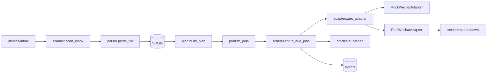

# 架构（现状 + 治理轮基线）

## 当前运行架构

## 代码模块分层（当前）

| 层级 | 模块 | 状态 |
|------|------|------|
| 入口层 | `cli.py` | 已实现 |
| 扫描解析 | `scanner.py` / `parser.py` / `dedupe.py` | 已实现 |
| 计划与执行 | `plan.py` / `scheduler.py` / `workflow.py` | 已实现 |
| 微信适配 | `adapters/mock.py` / `adapters/real.py` / `adapters/wechat_http.py` | 已实现（默认 mock） |
| Web 管理 | `web/app.py` | 部分实现（轻量） |
| 渲染层 | `renderers/` | 新增骨架（最小 Markdown 段落渲染） |

## 数据结构（SQLite）

- `articles`：文章主表，含 `status`（`imported/published/rejected`）
- `publish_jobs`：发布任务表，含 `status`（`pending/running/done/failed/cancelled`）与 `retry_count`
- `wechat_drafts`：草稿记录表，保存 `media_id` 与响应快照
- `events`：审计事件表，记录扫描、排期、执行、失败与警告

## 关键安全边界

- 默认 `WECHAT_MODE=mock`
- 日志与事件 payload 对 token/secret 做脱敏
- `WECHAT_ENABLE_PUBLISH=false` 时 real 模式仅建草稿不发布
- digest 上传前统一截断到 120，并记录 `digest_truncated_warning`

## 设计中能力（未在本轮实现）

- 内容库统一抽象（`content_library/`）
- 调度域模块化（`scheduler/` 目录骨架）
- 封面资产中心（`cover_assets/`）
- 独立数据库迁移体系（`migrations/`）
