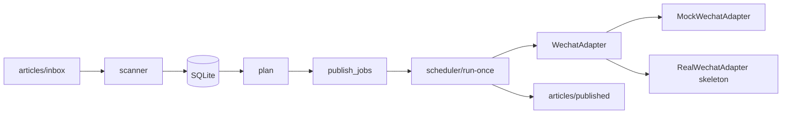

# 架构

## 数据流

## 模块

| 模块 | 职责 |
|------|------|
| `parser` | 解析 frontmatter / 标题 / 摘要 / content_hash |
| `dedupe` | 按 rules.yaml 去重 |
| `scanner` | inbox → DB → imported |
| `plan` | 生成 `publish_jobs` |
| `scheduler` | 到期任务 → 草稿 → 发布（mock） |
| `adapters` | mock / real 微信 API 边界 |

## 表结构

- `articles`：文稿与状态
- `publish_jobs`：计划发布时间
- `wechat_drafts`：草稿 media_id（mock）
- `events`：审计日志
