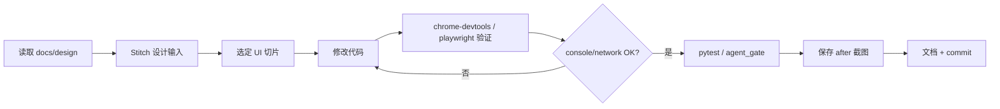

# Cursor 浏览器 UI 推进 Runbook

本 runbook 面向 **Cursor Agent** 在本仓库执行 UI 优化、浏览器验证与 Stitch 设计协作时的标准流程。  
**不是**业务功能开发指南；业务边界仍以 `AGENTS.md`、`docs/rounds.md` 为准。

相关文档：

- 工具注册排查：[`docs/cursor_tool_registry_check.md`](cursor_tool_registry_check.md)
- MCP 使用技能：[`docs/agent_skills/mcp_usage_skill.md`](agent_skills/mcp_usage_skill.md)
- 浏览器调试技能：`.cursor/skills/browser-debug-check/SKILL.md`
- 微信已登录 Chrome：[`docs/wechat_chrome_session_runbook.md`](wechat_chrome_session_runbook.md)
- UI 实现 Prompt 模板：[`docs/prompts/CURSOR_UI_IMPLEMENTATION_PROMPT.md`](prompts/CURSOR_UI_IMPLEMENTATION_PROMPT.md)

---

## 1. Cursor 浏览器任务的基本原则

### MCP ready ≠ 当前 Agent 线程可用

- `npm run check:mcp`、`cursor-agent mcp list`、Settings → Tools & MCP 显示 **ready**，只说明 **CLI / 配置层** 可用。
- **当前 Agent 对话线程** 是否实际暴露了 `chrome-devtools`、`playwright`、`stitch` 等原生工具，是另一回事。
- 旧对话、Multitask 子 Agent、批准 MCP 后未重启的进程，都可能 **看不到** 最新工具注册表。

### Settings 中启用 ≠ 旧对话能调用

- 在 Cursor Settings 中启用 MCP 后，**已打开的旧 Agent 对话不会自动刷新工具列表**。
- 必须在 **新建普通前台 Agent 对话** 中重新验证工具是否可用。

### 批准 MCP 后需要完全退出 Cursor 并重开仓库

1. 在 Settings → Tools & MCP 批准所需 server。
2. **完全退出 Cursor**（不是仅 Reload Window；首次批准或工具仍缺失时优先完全退出）。
3. 重新打开本仓库。
4. **新建** 普通前台 Agent 对话（禁用 Multitask）。
5. 在对话开头确认当前线程是否暴露目标 MCP 工具。

### 浏览器任务必须使用普通前台 Agent

- 涉及 `browser` / `chrome-devtools` / `playwright` / `wechat-chrome-session` 的任务，必须在 **普通前台 Agent 对话** 中执行。
- **禁止** 使用 Multitask 或后台子 Agent 控制浏览器。

### 禁止 Multitask / 后台子 Agent 执行浏览器控制任务

- Multitask 子 Agent **通常不继承** Workspace MCP 工具注册表。
- 若在 Multitask 中发现缺少浏览器工具，**立即停止**，要求用户切换到普通前台 Agent。
- 详见 `.cursor/rules/no-multitask-for-browser.mdc`。

### 浏览器任务开始前必须检查当前线程实际暴露的工具

Agent 必须在任务开始时自检：

1. 当前工具列表中是否存在所需 MCP 的原生工具（例如 `browser_snapshot`、`list_pages` 等）。
2. 不要只依赖 `cursor-agent mcp list` 或 `.cursor/mcp.json` 存在性。

### 缺少工具时必须 BLOCKED，不得假装执行

若当前线程没有暴露目标工具，输出：

```text
BLOCKED: MISSING_FROM_THREAD_TOOL_REGISTRY
```

并停止浏览器相关操作。不得：

- 仅凭代码静态阅读判断 UI 已完成；
- 用 `browser_tabs`（Cursor 内置浏览器）冒充 `chrome-devtools` / `playwright`；
- 用 `playwright --isolated` 冒充已登录微信公众号后台。

用户应：

1. 完全退出 Cursor；
2. 重新打开仓库；
3. 在 Settings → Tools & MCP 确认工具 ready；
4. 新建普通前台 Agent 对话；
5. 禁用 Multitask；
6. 重新执行任务。

---

## 2. 工具选择规则

### 普通本地 Web 项目 UI 优化

**优先使用：**

| MCP | 用途 |
|-----|------|
| **stitch** | 生成 UI 设计依据（screen、variants、截图、HTML）；仅作设计输入 |
| **chrome-devtools** | 检查页面、console、network、截图、性能 |
| **playwright** | E2E 流程、稳定回归、多 viewport 截图 |
| **filesystem** | 检查代码与产物真实状态（仅 `${workspaceFolder}`） |
| **context7** | 查询前端库 / 框架文档 |
| **github** | commit、push、issue、PR、CI 状态 |

**启动本地 Web 工作台：**

```bash
python -m wechat_article_scheduler.cli serve
# 默认 http://127.0.0.1:8080/
```

**不得用于微信公众号已登录后台。**

### 微信公众号已登录页面操作

**只使用：**

- **wechat-chrome-session**（`.cursor/mcp.json` 中 `--autoConnect` 配置）

**禁止使用：**

- 普通 `chrome-devtools`（独立 profile，无登录态）；
- `playwright` / `playwright --isolated`（新开隔离浏览器）；
- Cursor 内置 `browser_tabs`；
- `new_page`、`navigate_page` 等会新开未登录浏览器的工具。

完整连接步骤见 [`docs/wechat_chrome_session_runbook.md`](wechat_chrome_session_runbook.md)。

### 真实页面 UI 优化

每次 UI 改造必须执行完整闭环：

| 阶段 | 动作 |
|------|------|
| Before | 打开页面 → 截图 → 检查 console → 检查 network → 记录 before 状态 |
| 实现 | 读取 Stitch 设计 / 修改代码（每轮只改一个主要 UI 切片） |
| After | 重新打开页面 → 截图 → 检查 console → 检查 network → 记录 after 状态 |
| 收尾 | 修复发现的问题 → 运行测试 → 更新文档 → commit |

Before / after 截图建议保存到 `docs/reports/ui_review/` 或 `docs/design/stitch/screenshots/`。

---

## 3. 标准 UI 优化流程

固定 14 步流程（每轮 UI 推进遵循此顺序）：

1. **读取** `README.md`、`AGENTS.md`、`docs/rounds.md`（或 `docs/roadmap_converged.md`）、`docs/design/`。
2. **启动项目**：`python -m wechat_article_scheduler.cli serve`。
3. **打开页面**：使用 chrome-devtools 或 playwright（确认当前线程有对应工具）。
4. **保存 before screenshot**（含 console / network 检查结果摘要）。
5. **读取 Stitch 设计文档**或调用 Stitch MCP 生成设计输入。
6. **选择一个 UI 改造切片**（每轮只改一个主要区域，避免大范围混杂改动）。
7. **修改代码**（FastAPI + 原生 HTML/CSS/JS；Stitch 导出不得无审查覆盖业务代码）。
8. **重新打开页面**（刷新或 navigate）。
9. **检查 console / network**（核心 API 无 4xx/5xx；无未解释 error）。
10. **检查响应式**（desktop 1280、tablet 768、mobile 375 至少 spot-check）。
11. **运行测试**：`python -m pytest` 或 `python scripts/agent_gate.py gate`。
12. **保存 after screenshot**。
13. **更新文档**（必要时更新 `docs/design/stitch/reviews/` 或 UI 评审记录）。
14. **commit / push**（用户明确要求时；提交前 `git diff` 确认无密钥）。

---

## 4. 当前线程工具检查

### 规则

若用户要求使用某个 MCP，Agent **必须先确认「当前对话线程」是否暴露对应原生工具**。

**不要只依赖：**

- `cursor-agent mcp list`（CLI 层 ready）；
- Settings → Tools & MCP 中的 ready 状态；
- `.cursor/mcp.json` 文件存在。

**必须依赖：**

- 当前 Agent 对话中实际可调用的 MCP 工具列表（例如 Playwright 的 `browser_navigate`、chrome-devtools 的页面工具、wechat-chrome-session 的 `list_pages` 等）。

### 自检清单

| 任务类型 | 必须存在的工具示例 |
|----------|-------------------|
| 本地 Web UI | playwright 或 chrome-devtools 页面工具 |
| Stitch 设计 | stitch MCP 工具 |
| 微信已登录后台 | wechat-chrome-session 的 `list_pages` / `select_page` |
| 文件确认 | filesystem 读写工具 |
| 文档查询 | context7 查询工具 |

### BLOCKED 输出格式

```text
BLOCKED: MISSING_FROM_THREAD_TOOL_REGISTRY

缺失工具：<server-name>（例如 chrome-devtools、wechat-chrome-session）

当前线程未暴露所需 MCP 原生工具。CLI 层可能显示 ready，但本对话无法调用。

请用户：
1. 完全退出 Cursor
2. 重新打开本仓库
3. Settings → Tools & MCP 确认 server ready 并已批准
4. 新建普通前台 Agent 对话（禁用 Multitask）
5. 重新发起 UI 推进任务

参考：docs/cursor_tool_registry_check.md
```

### CLI 层检查（辅助，非充分条件）

```bash
npm run check:cursor-mcp
# 或
bash scripts/check_cursor_mcp_status.sh
npm run check:mcp
npm run check:stitch
```

**注意：** 上述脚本只验证 CLI / 配置层，**不代表**当前 Agent 对话线程已暴露工具。

---

## 5. Stitch + chrome-devtools + playwright 协作工作流



| 阶段 | 负责 MCP | 说明 |
|------|----------|------|
| 设计 | stitch | 生成 screen / HTML / 截图；保存到 `docs/design/stitch/` |
| 调试 | chrome-devtools | console、network、DOM、性能 |
| 回归 | playwright | E2E 路径、多 viewport、稳定重复 |
| 文件 | filesystem | 确认模板 / 静态资源真实存在 |
| 文档 | context7 | FastAPI、Playwright 等 API 查询 |

Stitch **不能**无审查覆盖 `src/wechat_article_scheduler/web/` 等业务代码。

---

## 6. 微信 vs 本地 Web 工具隔离

| 场景 | 使用 | 禁止 |
|------|------|------|
| 本地工作台 `http://127.0.0.1:8080/` | chrome-devtools、playwright | wechat-chrome-session |
| 微信公众号后台 `mp.weixin.qq.com`（已登录） | wechat-chrome-session | chrome-devtools、playwright、browser_tabs |
| UI 设计 | stitch | — |
| 扫码 / 验证码 / 风控 | — | Agent 必须停止，等待用户人工处理 |

---

## 7. 验证命令速查

```bash
# MCP 配置（文件层）
npm run check:mcp
npm run check:stitch

# MCP 状态（CLI 层；不代表当前线程）
npm run check:cursor-mcp

# 测试门控
python scripts/agent_gate.py gate
python -m pytest
```

---

## 8. 参考

- [Cursor 工具注册检查](cursor_tool_registry_check.md)
- [UI 实现 Prompt 模板](prompts/CURSOR_UI_IMPLEMENTATION_PROMPT.md)
- `.cursor/rules/cursor-browser-ui.mdc`
- `.cursor/rules/no-multitask-for-browser.mdc`
- `.cursor/rules/mcp-required.mdc`
- `.cursor/rules/verification-gate.mdc`
